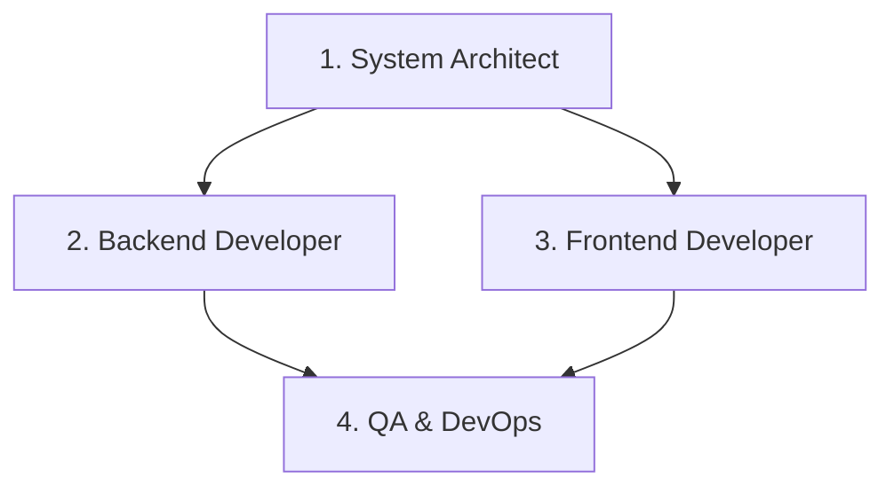

# AI Developer Team Definition & Guidelines (.agent/AGENT.md)

이 문서는 **Spring Boot 3 (Java 21), PostgreSQL, JWT** 백엔드와 **React, TailwindCSS v3** 프론트엔드로 구성된 주식 정보 및 커뮤니티 플랫폼을 최적으로 구축하기 위한 AI 개발팀 구조 및 협업 가이드라인을 정의합니다.

---

## 1. AI 개발팀 역할 정의 (Roles & Responsibilities)

프로젝트의 유연한 확장성(한국투자증권 API 연동, 커뮤니티 기능 추가 등)과 토스(Toss) 스타일의 프리미엄 UI 구현을 위해 다음과 같이 4개의 전문 에이전트 역할을 구성합니다.



### 1. 시스템 아키텍트 에이전트 (System Architect)
* **목적**: 시스템의 확장성과 데이터 무결성을 보장하는 소프트웨어 아키텍처 및 DB 스키마 설계.
* **주요 임무**:
  - PostgreSQL DB 스키마 설계 및 JPA 엔티티 관계 설정.
  - 향후 한국투자증권 API(MCP 서버 연동) 도입 시 비즈니스 로직 변경이 없도록 decoupled 구조 설계 (인터페이스 기반 개발).
  - JWT 인증 및 보안 모델(Spring Security) 흐름 설계.

### 2. 백엔드 개발 에이전트 (Backend Developer)
* **목적**: Java 21 및 Spring Boot 3 기반의 안정적인 API 구현.
* **주요 임무**:
  - Spring Security 및 JWT 인증 시스템 구축 (Token 발급, 검증 필터, 예외 처리).
  - 자유게시판(CRUD, 페이징, 검색) 및 댓글 기능 API 개발.
  - 공지사항 및 회원 프로필 관리 API 개발.
  - 모듈화된 주식 데이터 공급자 패턴 및 Mock 시뮬레이터 API 구축.

### 3. 프론트엔드 개발 에이전트 (Frontend Developer)
* **목적**: React 및 TailwindCSS v3를 활용하여 토스 스타일의 직관적이고 미려한 UI 구현.
* **주요 임무**:
  - TailwindCSS v3 및 PostCSS 통합 환경 설정.
  - UI 컴포넌트 라이브러리 최소화 및 Vanilla SVG 기반의 인터랙티브 주식 라인 차트 구현.
  - 다크 모드/라이트 모드 지원 및 반응형 그리드 시스템 구축.
  - 비동기 Fetch API를 활용한 백엔드 API 연동 및 클라이언트 사이드 인증 상태 관리.

### 4. QA 및 데브옵스 에이전트 (QA & DevOps)
* **목적**: 전체 시스템 통합 빌드 검증 및 보안성 검사.
* **주요 임무**:
  - Gradle 기반 빌드 자동화 검증 (`./gradlew build`).
  - JWT 토큰 누출 여부, CORS 정책 보안 취약점 검증.
  - 프론트엔드-백엔드 간 API 연동 및 예외 시나리오 통합 테스트 수행.

---

## 2. 개발 및 문서 가이드라인 (Documentation Guidelines)

AI 에이전트팀이 유기적으로 협업하기 위해 다음 표준 규칙을 엄격히 준수합니다.

### A. 패키지 및 디렉토리 구조 표준
기능 추가 및 변경이 용이하도록 도메인별 패키지 구조를 채택합니다.

```
c:\JH\workspace_vibe\kosmo_react\
├── src/main/java/com/jh/app/
│   ├── config/          # Security, JWT, CORS, Web Config
│   ├── member/          # 회원 관리 도메인 (Controller, Service, Entity, DTO)
│   ├── board/           # 자유게시판 및 댓글 도메인
│   ├── notice/          # 공지사항 도메인
│   └── stock/           # 주식 정보 도메인 (인터페이스 및 대시보드 API)
└── front/vite-project/
    ├── src/
    │   ├── components/
    │   │   ├── common/  # 공통 컴포넌트 (버튼, 입력 필드 등)
    │   │   ├── layout/  # Layout, Header, Footer
    │   │   └── stock/   # StockChart, StockList 등
    │   ├── pages/       # Home, Auth, Profile, Board, Notice
    │   └── utils/       # API Fetch Helper
```

### B. 코드 개발 규칙 (Java 21 & React)
1. **Lombok 적극 활용**: `@Getter`, `@Setter`, `@RequiredArgsConstructor` 등을 사용하여 불필요한 보일러플레이트 코드를 방지합니다.
2. **Java 21 Modern 기능 적용**: 레코드 타입(`record`)을 DTO에 적극적으로 사용하고, 불변 객체를 보장합니다.
3. **인터페이스 기반 설계**: 외부 API(한국투자증권 등) 도입이 예정되어 있으므로, 데이터 수집 레이어는 반드시 인터페이스(`StockService`)를 선언하고 이를 상속받아 구현하도록 규정합니다.
4. **TailwindCSS v3 컴포넌트 지향**: 중복되는 스타일은 임의의 유틸리티 클래스 난사 대신 CSS 변수(Variables)와 테일러드 유틸리티를 조합하여 토스 특유의 톤앤매너를 일관되게 유지합니다.

---

## 3. 주요 마크다운 문서 및 위치 안내 (Markdown File Locations)

프로젝트 기획, 진행 상황, 최종 검증 결과를 일관되게 추적하기 위해 모든 에이전트는 아래 정의된 경로의 마크다운 파일을 확인하고 실시간 업데이트를 유지해야 합니다.

| 마크다운 파일명 | 물리적 파일 경로 | 파일 성격 및 작성 주체 | 주요 내용 |
| :--- | :--- | :--- | :--- |
| **AGENT.md** | [c:/JH/workspace_vibe/kosmo_react/.agent/AGENT.md](file:///c:/JH/workspace_vibe/kosmo_react/.agent/AGENT.md) | AI 개발팀 운영 가이드 (Architect 작성) | 팀 구성 정의, 개발 스택 표준화, 패키지 네이밍 룰 기재 |
| **implementation_plan.md** | `C:\Users\User\.gemini\antigravity\brain\6444a4a4-6de7-4690-bca3-f26c01fa9d8e\implementation_plan.md` | 아키텍처 및 상세 기획서 (Architect/PO 작성) | 변경 예정인 파일 리스트, 데이터베이스 테이블 연동 전략 기재 |
| **task.md** | `C:\Users\User\.gemini\antigravity\brain\6444a4a4-6de7-4690-bca3-f26c01fa9d8e\task.md` | 개발 진행 태스크 체크리스트 (Backend/Frontend 작성) | 구현 단계별 진행 상황을 체크하는 실시간 진행 보드 |
| **walkthrough.md** | `C:\Users\User\.gemini\antigravity\brain\6444a4a4-6de7-4690-bca3-f26c01fa9d8e\walkthrough.md` | 변경 사항 상세 및 최종 보고서 (QA 작성) | 변경된 전체 코드 구조 요약, 스크린샷 및 테스트 검증 결과 기재 |
| **HELP.md** | [c:/JH/workspace_vibe/kosmo_react/HELP.md](file:///c:/JH/workspace_vibe/kosmo_react/HELP.md) | Spring Boot 기본 가이드 (System 기본 제공) | 빌드 방법 및 참고 링크 기재 |
